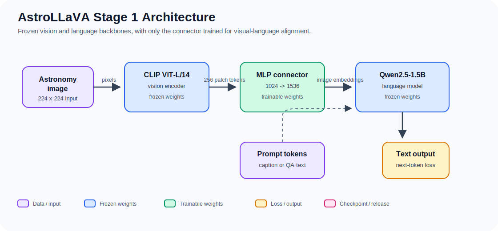
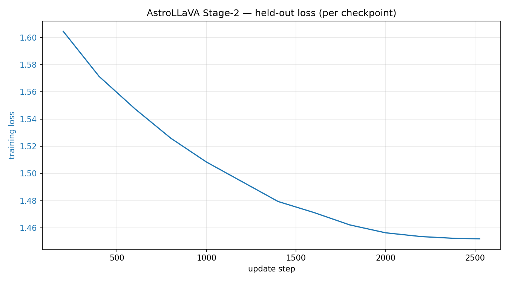
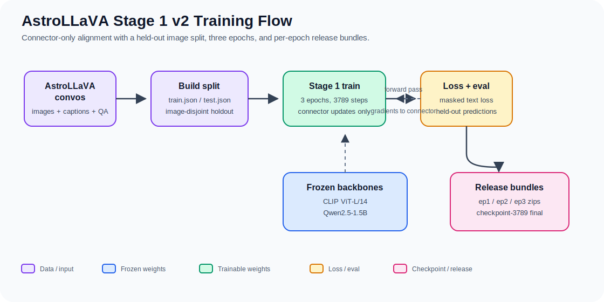

# Vision-Language Model (VLM) — Stage 1 Alignment + Stage 2 Instruction Tuning

A minimal, efficient implementation of a Vision-Language Model following the LLaVA architecture. **Stage 1** trains only a lightweight MLP connector to align frozen CLIP vision features with a frozen LLM. **Stage 2** then warm-starts that connector and fine-tunes the LLM with LoRA adapters on instruction (QA) data — closing the gap between coarse grounding and factual specificity, at minimal computational cost.

## Overview

This implementation bridges a frozen CLIP vision encoder (`openai/clip-vit-large-patch14`) and a frozen instruction-tuned LLM (`Qwen/Qwen2.5-1.5B-Instruct`) using a simple 2-layer MLP connector. Only the connector (~3.9M parameters) is trained on image-caption pairs; both the vision encoder and LLM remain frozen throughout training.

**Key Design Principles:**
- **Simplicity**: No Q-Former, no cross-attention — just a linear projection with GELU
- **Efficiency**: Frozen models save memory; only train the connector
- **Proven approach**: Follows LLaVA Stage 1 alignment, a well-validated recipe

> Models trained with this codebase on astronomy image–text data are released on the Hub:
> **Stage 1** (connector) at [`grKnight/astrollava-stage1`](https://huggingface.co/grKnight/astrollava-stage1)
> and **Stage 2** (connector + LoRA) at [`grKnight/astrollava-stage2`](https://huggingface.co/grKnight/astrollava-stage2).
> See [Trained Model: AstroLLaVA Stage-1](#trained-model-astrollava-stage-1-astronomy) and
> [Stage 2: Visual Instruction Tuning (LoRA)](#stage-2-visual-instruction-tuning-lora) for dataset,
> training, testing, and download details.

## Architecture



```
Image (3, 224, 224)
    ↓
[CLIP ViT-L/14 — Frozen] → 256 patch tokens (B, 256, 1024)
    ↓
[MLP Connector — Trainable] → (B, 256, 1536)
    ↓ (concatenated with)
Text Embeddings (B, T, 1536) from LLM embedding table
    ↓
[Qwen2.5-1.5B-Instruct — Frozen] → Loss
```

**Training objective**: Next-token prediction on image-text pairs. Visual tokens are masked out of the loss; only the caption tokens contribute to gradient updates on the connector.

## Installation

```bash
# Clone or navigate to the project directory
cd vlm

# Install dependencies
pip install -r requirements.txt
```

**Requirements:**
- Python ≥ 3.10
- PyTorch ≥ 2.1.0
- CUDA 11.8+ (for GPU training)
- GPU memory scales with caption length: short-caption datasets (e.g. LLaVA-Pretrain) are light, while the astronomy Stage-1 run (long captions + QA, batch 8) measured **~38 GB** on an RTX 6000 Ada — see [Trained Model: AstroLLaVA Stage-1](#trained-model-astrollava-stage-1-astronomy)

## Quick Start

### 1. Prepare Data

Download the LLaVA-Pretrain dataset or use your own image-text pairs in LLaVA format:

```json
[
  {
    "id": "...",
    "image": "path/to/image.jpg",
    "conversations": [
      {"from": "human", "value": "<image>\nDescribe this image."},
      {"from": "gpt", "value": "A detailed caption here."}
    ]
  },
  ...
]
```

### 2. Configure Training

Edit `configs/pretrain_stage1.yaml`:

```yaml
data:
  train_data_path: "/path/to/train.json"  # your LLaVA-format dataset
  image_dir: "/path/to/images"
  max_length: 2048

training:
  output_dir: "./checkpoints/pretrain-stage1"
  per_device_batch_size: 8
  gradient_accumulation_steps: 32  # effective batch = 256
  num_epochs: 1
```

### 3. Train

```bash
# Single GPU
python train.py --config configs/pretrain_stage1.yaml

# Multi-GPU with accelerate
accelerate launch train.py --config configs/pretrain_stage1.yaml
```

Training logs appear in stdout. Checkpoints are saved every 500 steps to `./checkpoints/pretrain-stage1/`.

### 4. Inference

```bash
python inference.py \
  --config configs/pretrain_stage1.yaml \
  --checkpoint ./checkpoints/pretrain-stage1/checkpoint-500 \
  --image /path/to/image.jpg \
  --prompt "What is in this image?"
```

## Project Structure

```
vlm/
├── train.py                        # Training entry point
├── inference.py                    # Inference script
├── requirements.txt                # Dependencies
├── configs/
│   └── pretrain_stage1.yaml        # Hyperparameter config
├── vlm_model/
│   ├── utils.py                    # Constants, helper functions
│   ├── connector.py                # MLP projection layer (trainable)
│   ├── vision_encoder.py           # CLIP ViT-L/14 wrapper
│   ├── language_model.py           # Qwen2.5-1.5B-Instruct wrapper
│   └── vlm.py                      # Composite VLM model
├── data/
│   ├── image_processing.py         # CLIP image transforms
│   ├── conversation.py             # Conversation tokenization + label masking
│   ├── dataset.py                  # LLaVAPretrainDataset
│   └── collator.py                 # Batch collation
└── training/
    ├── lr_scheduler.py             # Cosine warmup scheduler
    ├── checkpoint.py               # Checkpoint save/load
    └── trainer.py                  # Training loop
```

## Key Hyperparameters

| Parameter | Value | Rationale |
|-----------|-------|-----------|
| Learning Rate | 2e-3 | High (connector only), follows LLaVA |
| Weight Decay | 0.0 | No regularization needed for small connector |
| Batch Size | 256 (effective) | Via 8 × 32 (batch × accumulation) |
| Warmup | 3% of steps | Short warmup; model components are pre-trained |
| Schedule | Cosine decay | Smooth convergence to near-zero lr |
| Precision | bf16 | Mixed precision for efficiency |
| Epochs | 1 | Single pass over the pretraining set (LLaVA Stage-1 convention) |

## Performance & Memory

**Trainable Parameters**: ~3.9M (only the MLP connector)
**Frozen Parameters**: ~1.8B (CLIP + LLM)
**GPU Memory**: ~6–8 GB (batch_size=8, bf16) for short-caption datasets like LLaVA-Pretrain. Memory scales with sequence length: the astronomy Stage-1 run (long captions + QA, `max_length 512`) measured **~38 GB at batch_size=8** on an RTX 6000 Ada — plan on a 40 GB+ GPU at that batch, or a smaller batch / shorter `max_length` on 24 GB.

For measured throughput and training time on real data, see [Trained Model: AstroLLaVA Stage-1](#trained-model-astrollava-stage-1-astronomy) (~26 samples/s on an RTX 6000 Ada).

## What Gets Trained

Only the connector's weights are updated:
- `model.connector.mlp[0].weight` — (1536, 1024)
- `model.connector.mlp[0].bias` — (1536,)
- `model.connector.mlp[2].weight` — (1536, 1536)
- `model.connector.mlp[2].bias` — (1536,)

Both the vision encoder (`vision_encoder.model`) and LLM (`language_model.model`) are frozen via `requires_grad=False`.

## Data Format Details

The dataset expects a JSON file with the LLaVA-Pretrain structure:
- Each entry must have `"image"` (relative path to image), `"conversations"` (list of turns)
- Conversations are `[{"from": "human", "value": "..."}, {"from": "gpt", "value": "..."}]`
- The `<image>` placeholder in the human message is replaced with visual token embeddings during training
- Labels are masked (`-100`) for all tokens except the assistant's response

## Inference Details

During inference:
1. The image is preprocessed via CLIP's image processor (224×224 resize, normalization)
2. CLIP encodes it to 256 patch tokens (1024-dim each)
3. The connector projects to 1536-dim (LLM embedding space)
4. Text prompt is tokenized and embedded via the LLM's embedding layer
5. Visual and text embeddings are concatenated and fed to the LLM
6. Autoregressive generation proceeds with `model.generate(...)`

The `<image>` token in the prompt is automatically replaced with visual embeddings; it does not appear in the final token sequence.

## Trained Model: AstroLLaVA Stage-1 (Astronomy)

The Stage-1 connector trained with this codebase is released on the Hugging Face Hub:

**https://huggingface.co/grKnight/astrollava-stage1**

It was trained for **3 full epochs** on real astronomy image–text data, with a **disjoint held-out
test split** carved out before training so the connector can be evaluated on images it never saw.
Three per-epoch bundles are published — each contains that epoch's checkpoint, its **held-out**
predictions, the training config, the `test.json` split, and a `REPRODUCE.md`:

| Bundle | Checkpoint | |
|--------|-----------|--|
| [`astrollava-stage1-ep3.zip`](https://huggingface.co/grKnight/astrollava-stage1/blob/main/astrollava-stage1-ep3.zip) | `checkpoint-3789` (epoch 3, final) | **recommended** |
| [`astrollava-stage1-ep2.zip`](https://huggingface.co/grKnight/astrollava-stage1/blob/main/astrollava-stage1-ep2.zip) | `checkpoint-2500` (≈ epoch 2) | |
| [`astrollava-stage1-ep1.zip`](https://huggingface.co/grKnight/astrollava-stage1/blob/main/astrollava-stage1-ep1.zip) | `checkpoint-1300` (≈ epoch 1) | |

Each checkpoint is the connector only (`connector.safetensors`, ~16 MB) plus optimizer state. It
is **not** a standalone `transformers` model — it requires this repository's code and the two base
models (downloaded from the Hub) to run.

> **Superseded files.** An earlier release (`*-legacy-1epoch-no-heldout-*`) was trained to ~1 epoch
> only and evaluated on training images (no held-out split, so possible leakage). It is kept for
> record only — use the `ep1`/`ep2`/`ep3` bundles above.

### Dataset (with held-out test split)

Training used [`UniverseTBD/AstroLLaVA_convos`](https://huggingface.co/datasets/UniverseTBD/AstroLLaVA_convos)
(CC-BY-SA-4.0): ~29.8k astronomy images from NASA APOD, ESO, and the NASA/ESA Hubble Space
Telescope, each with a human-written caption and GPT-4-generated question–answer turns.
`scripts/build_astrollava_trainset.py` streams it, converts to LLaVA JSON, and holds out a fraction
of **images** as a disjoint test set (caption + QA kept together, seeded → deterministic):

```bash
python scripts/build_astrollava_trainset.py \
  --output-dir datasets/astrollava_llava --split train \
  --include-qa --max-image-size 384 --test-fraction 0.02 --seed 42
```

- The split is **per image**, so an image's caption and all its QA records stay on the same side —
  there is no train/test leakage.
- `--max-image-size 384` caps the long edge (CLIP uses 224×224 regardless) and re-encodes as JPEG;
  oversized (>100 MP) and unreadable frames are skipped rather than aborting the run.

| Split | Images | Records |
|-------|-------:|--------:|
| train (`train.json`) | 29,151 | 161,653 |
| held-out test (`test.json`) | 591 | 3,271 |

41 corrupt rows were skipped; 164,924 records total.

### Training

Config: `configs/pretrain_astrollava.yaml`; run `python train.py --config configs/pretrain_astrollava.yaml`.

| Setting | Value |
|---------|-------|
| Trainable / total params | 3,935,232 / 1,850,414,592 (0.21%) |
| Epochs / steps | 3 epochs, 3,789 update steps |
| Effective batch | 128 (per-device 8 × grad-accum 16) |
| Learning rate / schedule | 1e-3, cosine, 3% warmup |
| Max length | 512 (+256 image tokens) |
| Precision | bf16 |
| Hardware | 1× RTX 6000 Ada (48 GB) |
| Throughput / memory | ~26 samples/s, ~38 GB VRAM |
| Loss | ~2.08 → ~1.50 |

The connector is checkpointed every 100 steps: `checkpoint-1300` ≈ epoch 1, `checkpoint-2500` ≈
epoch 2, `checkpoint-3789` = final. A RunPod workflow for the full setup → build (with the held-out
split) → train sequence is documented in `RUNPOD.md` (`scripts/runpod_setup.sh`,
`scripts/runpod_train.sh`).

### Held-out evaluation

Each epoch checkpoint was scored on the **591 unseen test images** with a single model load:

```bash
python scripts/batch_inference.py \
  --config configs/pretrain_astrollava.yaml \
  --checkpoint checkpoints/astrollava-stage1/checkpoint-3789 \
  --image-dir datasets/astrollava_llava/images \
  --records-json datasets/astrollava_llava/test.json \
  --num-samples 0 --temperature 0 --output predictions_test_ep3.jsonl
```

`--records-json test.json` scores exactly the held-out images and attaches each one's reference
caption; the resulting `predictions_test_ep{1,2,3}.jsonl` ship in the bundles. Generation runs under
bf16 autocast to match training.

**Initial observations (spot check on held-out samples).** Comparing the same unseen images across
epochs showed a clear, monotonic improvement **epoch 1 → 2 → 3**:

| Held-out image (truth) | epoch 1 | epoch 2 | epoch 3 |
|---|---|---|---|
| SN 1987A supernova remnant (ring) | "planetary nebula" ✗ | "supernova remnant" ✓ category | **"SN 1987A … ring-like structure"** ✓ exact + ring |
| M27, the Dumbbell Nebula | "Crab Nebula" ✗ | "planetary nebula" ✓ category | **"planetary nebula … the Dumbbell Nebula"** ✓ correct name |
| Star trails (Earth's rotation) | "Milky Way disk" ✗ | "star trails … rotation" ✓ | "star trails … observatory" ✓ |

Epoch 1 misidentified all three (and produced an obvious hallucination); epoch 2 fixed the object
*category* on all three; epoch 3 additionally recovered the *specific* object on two — the SN 1987A
ring and the Dumbbell Nebula by name — on images it never trained on. Because the test set is held
out, that gain is genuine generalization, not memorization: the extra epochs paid off, and
`checkpoint-3789` (epoch 3) is the recommended weight.

**Limitation (Stage-1 ceiling).** The connector grounds on *coarse* visual structure (object class /
morphology) but still **hallucinates fine specifics** — catalog numbers, instruments, dates,
distances — filled from the frozen LLM's prior. More Stage-1 epochs do not remove this; a **Stage-2**
fine-tune (unfreezing the LLM, e.g. LoRA, on the QA pairs) is the next step. Note this is a
qualitative spot check on a few held-out samples, not a full quantitative benchmark.

### Reproduction

Each bundle includes a `REPRODUCE.md` pinning the code commit, base models, the dataset build
command (with `--test-fraction 0.02 --seed 42`), the training command, and package versions
(`torch 2.8.0+cu128`, `transformers 5.12.1`). The split is seeded, so the same build reproduces the
exact train/test partition.

## Stage 2: Visual Instruction Tuning (LoRA)

Stage 1 trains only the connector, so it grounds *coarse* visual structure but **hallucinates fine
specifics** (catalog numbers, instruments, dates, distances) — the frozen LLM fills those from its
prior. **Stage 2** addresses that ceiling: it warm-starts the Stage-1 connector and keeps training
it **while fine-tuning the Qwen LLM with LoRA adapters** on the same caption + QA data. The vision
encoder stays frozen.

```
image ─► CLIP ViT-L/14 (FROZEN) ─► MLP connector (TRAINED, init from Stage-1) ─► Qwen2.5-1.5B + LoRA (base FROZEN, LoRA TRAINED) ─► text
```

LoRA needs one extra dependency (already in `requirements.txt`):

```bash
pip install peft
```

### Released weights

The Stage-2 model trained with this codebase is published on the Hugging Face Hub:

**https://huggingface.co/grKnight/astrollava-stage2**

A single bundle
[`astrollava-stage2.zip`](https://huggingface.co/grKnight/astrollava-stage2/blob/main/astrollava-stage2.zip)
holds the final checkpoint (`checkpoint-2526`: `connector.safetensors` **+** `lora/adapter_model.safetensors`
& `adapter_config.json`), the **held-out** predictions (`predictions_test_stage2.jsonl`), the training
config, the `test.json` split, and a `REPRODUCE.md`. Like Stage-1 it is **not** a standalone
`transformers` model — it needs this repo's code, the two base models (auto-downloaded), and `peft`.

```bash
# download + unzip
hf download grKnight/astrollava-stage2 astrollava-stage2.zip --local-dir .
unzip astrollava-stage2.zip -d ckpt2

# answer a question about an image (CLIP + Qwen auto-download; peft loads the LoRA adapter)
python inference.py \
  --config ckpt2/finetune_astrollava_stage2.yaml \
  --checkpoint ckpt2/checkpoint-2526 \
  --image your_astro_image.jpg \
  --prompt "What type of object is this and what is notable about it?" \
  --temperature 0
```

| | |
|---|---|
| Trainable / total params | 22,400,000 / 1,868,879,360 (1.20%) |
| — connector (warm-started from Stage-1 `checkpoint-3789`) | 3,935,232 |
| — LoRA (`r=16`, `α=32`, `dropout=0.05`; `q/k/v/o/gate/up/down_proj` × 28 layers) | 18,464,768 |
| Data | same as Stage-1: train 161,653 recs / 29,151 imgs; held-out test 591 imgs / 3,271 recs |
| Epochs / steps | 1 epoch, 2,526 update steps |
| Effective batch | 64 (per-device 4 × grad-accum 16) |
| LR / schedule | 2e-4, cosine, 3% warmup (75 steps) |
| Max length | 512 (+256 image tokens) |
| Precision | bf16 (autocast) + gradient checkpointing |
| Hardware | 1× RTX 6000 Ada (48 GB), ~15 samples/s (~3 h) |
| Held-out loss | 1.60 → **1.452** (monotonic), recomputed per checkpoint on 512 held-out samples via [`scripts/eval_loss_curve.py`](scripts/eval_loss_curve.py); plateaus by end of epoch |



*Held-out validation loss per checkpoint (recomputed from the saved checkpoints on 512 unseen
`test.json` samples — the dense per-step training log wasn't retained). Monotonic 1.60 → 1.45,
flattening by the end of the single epoch.*

### Train



Reuse the **same** `train.json` / `images/` from the Stage-1 build (caption + QA, with the held-out
`test.json`). Point `stage1_checkpoint` at a trained Stage-1 connector (your own
`checkpoints/astrollava-stage1/checkpoint-3789`, or the released `grKnight/astrollava-stage1`
bundle), then:

```bash
python train.py --config configs/finetune_astrollava_stage2.yaml
```

| Setting | Value | Rationale |
|---------|-------|-----------|
| Trainable | connector (~3.9M) + LoRA adapters | base LLM + vision stay frozen |
| LoRA | `r=16`, `alpha=32`, `dropout=0.05`, targets `q/k/v/o/gate/up/down_proj` | standard Qwen2.5 LoRA set |
| Stage | `stage: 2` | switches the trainer to connector+LoRA and keeps the LLM in `train()` |
| Epochs | 1 | instruction-tuning convention |
| Effective batch | 64 (per-device 4 × grad-accum 16) | |
| Gradient checkpointing | `true` | **required** to fit the LLM backward pass in ~48 GB |
| Learning rate | 2e-4, cosine, 3% warmup | LoRA + connector (optional `connector_lr` for a split LR) |
| Precision | bf16 | |

**Memory:** Stage 1 was ~38 GB at batch 8 with *no* LLM gradients. Stage 2 adds the full-LLM
backward pass, so it uses `per_device_batch_size: 4` + gradient checkpointing. If it still OOMs on
48 GB, drop the batch to 2 and raise `gradient_accumulation_steps` to 32 (effective batch
unchanged).

Each Stage-2 checkpoint dir holds the continued-trained `connector.safetensors` **and** a
`lora/adapter_model.safetensors` (+ `adapter_config.json`). Stage-1 checkpoint dirs are unchanged
(no `lora/`), so they still load as before.

### Inference / held-out eval

Pass the Stage-2 **config** (so the LoRA modules are built) and a Stage-2 checkpoint; the loader
restores both the connector and the LoRA adapter automatically:

```bash
python inference.py \
  --config configs/finetune_astrollava_stage2.yaml \
  --checkpoint checkpoints/astrollava-stage2/checkpoint-2526 \
  --image your_astro_image.jpg \
  --prompt "What type of object is this and what is notable about it?" \
  --temperature 0

# Held-out comparison vs Stage-1 on the SAME unseen images:
python scripts/batch_inference.py \
  --config configs/finetune_astrollava_stage2.yaml \
  --checkpoint checkpoints/astrollava-stage2/checkpoint-2526 \
  --image-dir datasets/astrollava_llava/images \
  --records-json datasets/astrollava_llava/test.json \
  --num-samples 0 --temperature 0 --output predictions_test_stage2.jsonl
```

Diff `predictions_test_stage2.jsonl` against the published Stage-1 `predictions_test_ep3.jsonl`: the
Stage-2 hypothesis is fewer hallucinated specifics on the QA prompts, since the LLM (not just the
connector) now learns from the images.

## Medical RAG Layer (Retrieval-Augmented Grounding)

On top of the frozen VLM, this repo includes an **inference-time retrieval-augmented
generation (RAG) pipeline** for reducing hallucination in medical visual question
answering. It implements the research methodology in three phases:

1. **Phase 1 — Baseline hallucination characterization.** Evaluate the frozen VLM on
   **VQA-RAD** / **PathVQA** with **exact-match accuracy** *and* **NLI-based
   factual-consistency** (`eval/`).
2. **Phase 2 — Retrieval + ablation.** Build a corpus of image-report pairs, index dense
   clinical-SBERT report vectors and pooled CLIP visual embeddings in **FAISS** plus a
   **BM25** sparse index, retrieve top-k pairs and **prepend** them as a structured context
   block. Ablate **dense-visual / sparse-BM25 / hybrid (RRF + cross-encoder rerank)**
   (`retrieval/`, `corpus/`, `eval/ablation.py`).
3. **Phase 3 — Refinements (scaffolded).** Query decomposition, adaptive context windows,
   modality-aware weighting are wired as inert, config-gated hooks (`ragcore/phase3_stubs.py`).

**Key property:** grounding is entirely prompt-level. The retrieved references are inserted
*after* the `<image>` token and *before* the question, so `prepare_inputs_embeds` is
unchanged — **no retraining, no model/tokenizer/connector edits**. Model ids are
config-driven, so a domain-specialized medical VLM / encoder swaps in by editing
`configs/rag_eval.yaml` only.

### New packages

```
retrieval/   BaseRetriever seam + dense_visual / sparse_bm25 / hybrid + encoders, faiss, bm25, reranker
corpus/      CorpusLoader interface: iu_xray, roco (open), mimic_cxr (credentialed stub), synthetic; build_index
eval/        VQA-RAD/PathVQA loaders, exact-match, NLI consistency, runner, ablation driver
ragcore/     context formatting (prepend), checkpoint-optional model loader, Phase-3 stubs
rag_inference.py   retrieve -> format -> prepend -> model.generate
configs/rag_eval.yaml
```

### Install the extra dependencies

```bash
pip install faiss-cpu sentence-transformers rank-bm25
# (NLI factual-consistency reuses the existing `transformers` pipeline — no extra dep.)
```

### Usage

```bash
# 1. Build a tiny synthetic index (no downloads, no PHI) to smoke-test the wiring
python -m corpus.build_index --config configs/rag_eval.yaml --synthetic --max_pairs 10

# 2. Phase-1 no-retrieval baseline on a few VQA-RAD samples
python -m eval.ablation --config configs/rag_eval.yaml --modes no_retrieval --num_samples 5

# 3. Full ablation + comparison table (./rag_results/comparison.md)
python -m eval.ablation --config configs/rag_eval.yaml \
    --modes no_retrieval dense_visual sparse_bm25 hybrid --num_samples 5

# 4. Single grounded answer
python rag_inference.py --config configs/rag_eval.yaml \
    --image path/to/image.png --question "Is there cardiomegaly?" --mode hybrid
```

To use a real open corpus, set `corpus.name: roco` (verified: `eltorio/ROCO-radiology`) in
the config and re-run `corpus.build_index`. `iu_xray` has no canonical HF mirror — set
`corpus.hf_id` to one you've verified. `mimic_cxr` is a credentialed stub (PhysioNet access).
The model loader runs with an **untrained connector** when `model.checkpoint` is null — fine
for exercising retrieval and prompt formatting; set it to a trained connector dir for
meaningful generations.

### Running the real experiment on a GPU

A CUDA GPU is recommended; the first run downloads the encoder/LLM/NLI
weights (~7 GB total) and caches them. Datasets and the corpus **stream and are capped**, so
only what's needed downloads.

```bash
pip install -r requirements.txt          # includes faiss-cpu, sentence-transformers, rank-bm25

# One command: build the ROCO index, then run the full 4-way ablation on VQA-RAD.
python run_rag.py --config configs/rag_eval_gpu.yaml

# Reuse an already-built index and just re-run the eval:
python run_rag.py --config configs/rag_eval_gpu.yaml --skip-index
```

Results land in `./rag_results/` (`results_<mode>.json` per mode + `comparison.md`).
Tune `configs/rag_eval_gpu.yaml`: `corpus.max_pairs` (index size), `eval.num_samples`
(toward the full ~451 VQA-RAD test set for final numbers), `eval.benchmark` (`path_vqa`),
and `eval.modes`.

> **For meaningful numbers you need a trained VLM.** With `model.checkpoint: null` the
> connector is random and the answers (hence EM/NLI) are not meaningful — the run still
> validates the full pipeline. Train the connector first (`python train.py ...`) and set
> `model.checkpoint`, or swap `model.config` to a fully-trained medical VLM.

### Porting to another domain (astronomy example)

The pipeline is domain-agnostic; an astronomy variant ships as a worked example. The core
(`retrieval/`, `eval/runner.py`, `eval/ablation.py`, the prepend logic, Phase-3 hooks) is
reused **unchanged** — only domain-specific pieces were added:

- **Corpus:** `corpus/galaxy_zoo.py` — Galaxy10 DECaLS (`matthieulel/galaxy10_decals`,
  verified); morphology class labels are turned into descriptive "reports".
- **Benchmark:** `eval/astro_benchmarks.py` — VQA generated from the held-out test split
  (open "what type" + balanced closed yes/no), returned as the same `VQASample`.
- **Prompt wording:** now config-driven. `ragcore/context_format.py` reads an optional
  `prompt:` block (`system`, `references_header`, `references_footer`); medical text remains
  the default, so existing configs are untouched.
- **Config:** `configs/rag_eval_astro.yaml` (galaxy corpus/benchmark, general SBERT,
  astronomy prompt).

```bash
python run_rag.py --config configs/rag_eval_astro.yaml          # GPU
python run_rag.py --config configs/rag_eval_astro.yaml --synthetic --num_samples 5   # CPU smoke
```

What a *production* astronomy port still needs (documented, not done): swapping the CLIP
vision tower for an astronomy model (e.g. AstroCLIP) — which is not a drop-in `CLIPVisionModel`
and **requires retraining the connector** — plus FITS/dynamic-range image handling in
`data/image_processing.py`. Standard CLIP on RGB galaxy cutouts is adequate only for the
prototype.

### Known limitations
- **CLIP 224×224** downsamples fine medical detail (caps both VLM and dense-visual quality);
  `retrieval.visual_encoder_id` is swappable (e.g. BiomedCLIP).
- **NLI domain mismatch:** the default `roberta-large-mnli` under-handles clinical
  negation/hedging; swap `eval.nli_model_id` for a MedNLI/SciNLI checkpoint and read NLI as
  relative-across-modes.
- **FAISS `IndexFlatIP`** is exact and correct at sample scale; swap to IVF/HNSW in
  `retrieval/faiss_index.py` for MIMIC-scale corpora.

## Next Steps

This implementation covers **Stage 1: Feature Alignment** and **Stage 2: Visual Instruction Tuning
(LoRA)** (see [Stage 2: Visual Instruction Tuning (LoRA)](#stage-2-visual-instruction-tuning-lora)).
Further extensions might include:

1. **Full Model Tuning** — Unfreeze all LLM layers (instead of LoRA) for more capacity at higher VRAM cost
2. **Cross-Attention Connector** — Replace MLP with a learned cross-attention mechanism for better spatial reasoning
3. **Higher-Resolution Images** — Support variable image resolutions and dynamic patching
4. **Multi-Image Support** — Handle multiple images per prompt
5. **Evaluation** — Add benchmarks (VQA, captioning, visual reasoning tasks)

## Troubleshooting

**Out of Memory (OOM)**
- Reduce `per_device_batch_size` (try 4 or 2)
- Increase `gradient_accumulation_steps` to maintain effective batch size
- Enable `bf16` mixed precision (already default)

**Slow Data Loading**
- Increase `dataloader_num_workers` (try 8 or 16)
- Pre-extract CLIP features to disk to bypass image I/O

**NaN Loss**
- Check label masking: visual token positions should have `labels = -100`
- Verify `attention_mask` has correct shape and no all-zero rows
- Reduce learning rate if instability persists

## References

- **LLaVA**: [Visual Instruction Tuning](https://arxiv.org/abs/2304.08485)
- **CLIP**: [Learning Transferable Models for Compositional Vision](https://arxiv.org/abs/2103.14030)
- **Qwen**: [Qwen2.5 Technical Report](https://qwenlm.github.io/blog/qwen2.5/)

## License

MIT License. See LICENSE file (if present) for details.

## Contributing

Contributions are welcome. Please:
1. Test your changes with a small dataset subset
2. Verify trainable params count and gradient flow
3. Include clear commit messages

## Questions?

For issues or questions about the implementation, check the inline comments in `vlm_model/vlm.py` (especially `prepare_inputs_embeds()`) and `training/trainer.py` for detailed logic.
